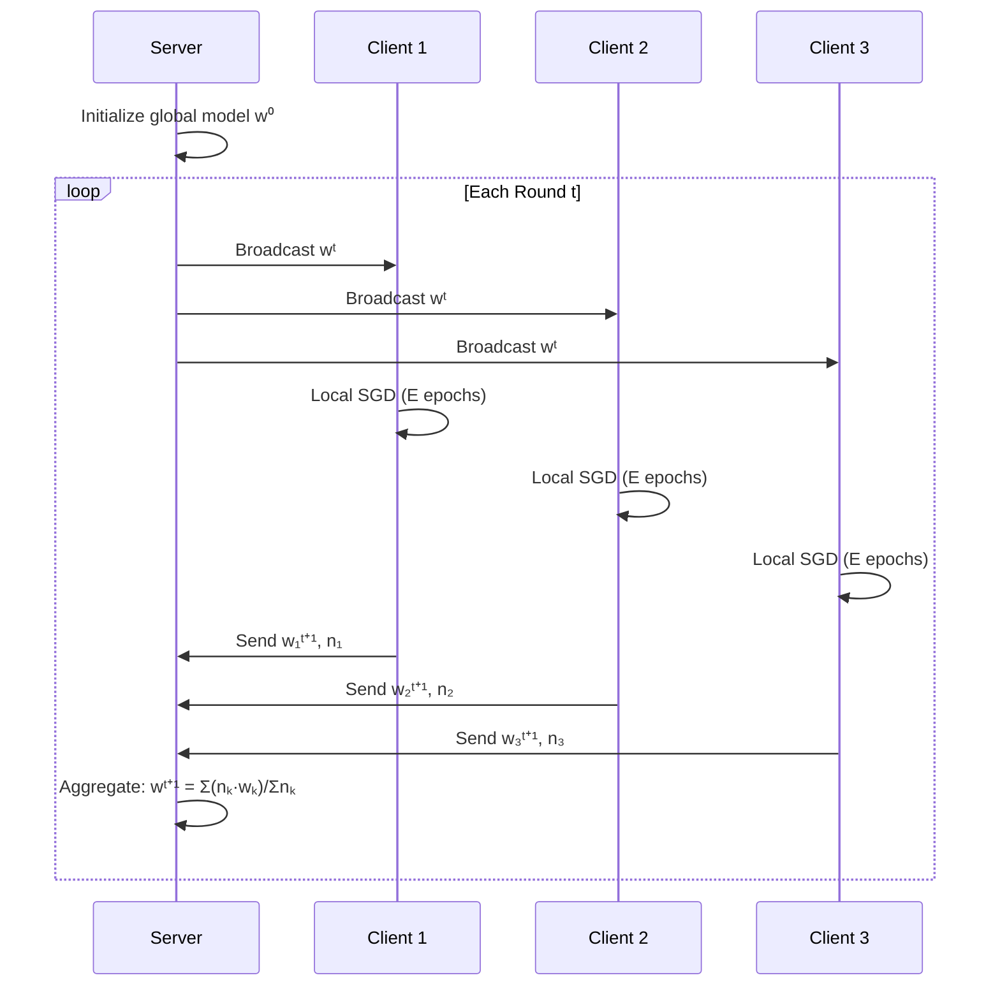
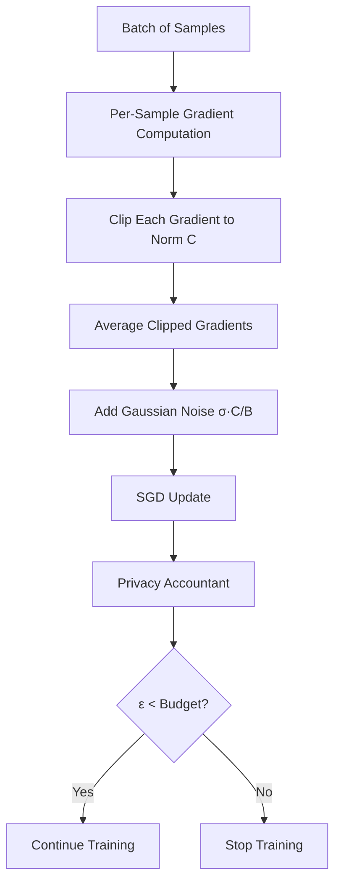
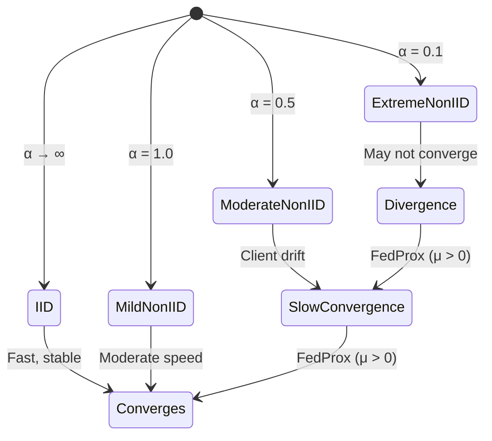

# Privacy-Preserving Federated Learning

Federated learning framework implementing FedAvg and FedProx aggregation, differential privacy via DP-SGD, secure aggregation simulation, and non-IID data handling with Dirichlet partitioning — trains across simulated clients without sharing raw data.

## Theory & Background

### Why Federated Learning Matters

Traditional machine learning requires centralizing all training data on a single server. This breaks down when data is sensitive (medical records, financial transactions, personal messages) or legally restricted (GDPR, HIPAA). Federated learning flips the paradigm: instead of bringing data to the model, we bring the model to the data. Each client trains locally on its private dataset and sends only model updates (weights or gradients) to a central server, which aggregates them into a global model. No raw data ever leaves the client.

The key challenge is that this distributed setup introduces three problems that don't exist in centralized training: **statistical heterogeneity** (clients have different data distributions), **communication cost** (sending full model weights every round is expensive), and **privacy leakage** (model updates can still reveal information about the training data). This project addresses all three.

### Federated Averaging (FedAvg)

FedAvg is the foundational algorithm. In each round, the server selects a subset of clients, broadcasts the current global model, each client trains locally for several epochs, and the server aggregates the updated weights using a weighted average proportional to dataset size.



The aggregation rule weights each client's contribution by its dataset size $n_k$. Given $K$ selected clients with local weights $w_k$ and sample counts $n_k$, the new global model is:

```math
w^{t+1} = \sum_{k=1}^{K} \frac{n_k}{\sum_{j=1}^{K} n_j} \cdot w_k^{t+1}
```

This is equivalent to a single SGD step on the union of all client data when clients train for exactly one epoch. With multiple local epochs, FedAvg implicitly performs multiple local updates before averaging, which speeds convergence but can cause **client drift** — clients diverge from each other when their data distributions differ.

### FedProx: Handling Heterogeneity

FedProx addresses client drift by adding a proximal regularization term to each client's local objective. This penalizes the local model for straying too far from the global model during training:

```math
\min_{w} \; F_k(w) + \frac{\mu}{2} \|w - w^t\|^2
```

where $F_k(w)$ is the local loss on client $k$'s data, $w^t$ is the current global model, and $\mu$ controls the strength of the proximal term. When $\mu = 0$, FedProx reduces to FedAvg. Higher $\mu$ values keep clients closer to the global model, improving stability on non-IID data at the cost of slower local adaptation.

### Differential Privacy with DP-SGD

Even without sharing raw data, model updates can leak information. An adversary observing weight changes could infer whether a specific record was in the training set (membership inference). DP-SGD provides a formal privacy guarantee by modifying the gradient computation:

1. **Per-sample gradient clipping**: Each sample's gradient is computed independently and clipped to a maximum L2 norm $C$
2. **Noise addition**: Calibrated Gaussian noise is added to the average clipped gradient
3. **Privacy accounting**: The cumulative privacy cost $\varepsilon$ is tracked across rounds



The noise scale is calibrated to the clipping norm and batch size. For a batch of $B$ samples with clipping norm $C$ and noise multiplier $\sigma$, the noisy gradient update is:

```math
\tilde{g} = \frac{1}{B} \left( \sum_{i=1}^{B} \text{clip}(g_i, C) + \mathcal{N}(0, \sigma^2 C^2 \mathbf{I}) \right)
```

where $\text{clip}(g, C) = g \cdot \min(1, C / \|g\|_2)$. The privacy accountant uses Rényi Differential Privacy (RDP) composition to track the cumulative privacy loss. For a subsampled Gaussian mechanism with sampling rate $q$ and noise multiplier $\sigma$, the RDP guarantee at order $\alpha$ after $T$ steps composes linearly:

```math
\varepsilon_{\text{RDP}}(\alpha) = T \cdot \frac{\alpha}{2\sigma^2} \quad \text{(full-batch)}
```

The RDP guarantee is then converted to $(\varepsilon, \delta)$-DP using $\varepsilon = \varepsilon_{\text{RDP}} - \frac{\log \delta}{\alpha - 1}$, optimized over all orders $\alpha$.

### Non-IID Data Partitioning

Real federated data is rarely IID. A hospital in a rural area sees different conditions than one in a city. This project simulates non-IID distributions using Dirichlet allocation. For each class $c$, we draw a proportion vector from $\text{Dir}(\alpha)$ across clients:

```math
p_c \sim \text{Dirichlet}(\alpha, \ldots, \alpha) \in \mathbb{R}^K
```

Lower $\alpha$ values create more skewed distributions — at $\alpha \to 0$, each client gets samples from only one class. At $\alpha \to \infty$, the partition approaches IID. Heterogeneity is measured using the average Jensen-Shannon divergence between each client's label distribution and the global distribution.



### Secure Aggregation

Even with differential privacy on individual clients, the server sees each client's model update in the clear. Secure aggregation ensures the server only learns the aggregate — no individual client's update is revealed. This implementation simulates a secret-sharing protocol where each pair of clients generates shared random masks that cancel out during summation.

### Tradeoffs and Alternatives

**FedAvg vs. FedProx**: FedAvg is simpler and faster per round, but diverges on highly non-IID data. FedProx adds a single hyperparameter $\mu$ that stabilizes training at the cost of slightly slower convergence on IID data. For most practical deployments with heterogeneous clients, FedProx with $\mu \in [0.01, 0.1]$ is the safer default.

**DP-SGD noise vs. utility**: There's a fundamental tension between privacy and model accuracy. Higher noise multiplier $\sigma$ gives stronger privacy (lower $\varepsilon$) but degrades model performance. The clipping norm $C$ also matters — too low clips useful gradient signal, too high lets noise dominate. Typical practice: $C = 1.0$, $\sigma \in [0.5, 1.5]$, targeting $\varepsilon \in [3, 10]$.

**Secure aggregation overhead**: The simulated secret-sharing protocol adds $O(K^2)$ communication overhead for $K$ clients. Production systems use more efficient protocols (e.g., Bonawitz et al.'s protocol with $O(K \log K)$ overhead) or trusted execution environments.

**Client selection**: Random selection is simple but can be inefficient. Strategies like selecting clients with the largest local losses or most diverse data can speed convergence, but introduce bias and complicate privacy analysis.

### Key References

- McMahan et al., "Communication-Efficient Learning of Deep Networks from Decentralized Data" (2017) — [arXiv](https://arxiv.org/abs/1602.05629)
- Li et al., "Federated Optimization in Heterogeneous Networks" (FedProx, 2020) — [arXiv](https://arxiv.org/abs/1812.06127)
- Abadi et al., "Deep Learning with Differential Privacy" (2016) — [arXiv](https://arxiv.org/abs/1607.00133)
- Bonawitz et al., "Practical Secure Aggregation for Privacy-Preserving Machine Learning" (2017) — [arXiv](https://arxiv.org/abs/1611.04482)
- Mironov, "Rényi Differential Privacy" (2017) — [arXiv](https://arxiv.org/abs/1702.07476)

## Real-World Applications

Federated learning enables organizations to train machine learning models on sensitive data that can never leave its source — whether due to regulation, competitive concerns, or sheer data volume. It unlocks collaborative AI without requiring data centralization.

| Industry | Use Case | Impact |
|----------|----------|--------|
| Healthcare | Training diagnostic models across hospitals without sharing patient records | HIPAA-compliant AI that benefits from multi-institution data diversity |
| Mobile Devices | On-device keyboard prediction and voice recognition | Personalized models trained on billions of devices without uploading conversations |
| Financial Services | Fraud detection across banks without sharing transaction data | Cross-institution pattern detection while preserving customer privacy |
| Telecommunications | Network anomaly detection across regional operators | Collaborative threat detection without exposing network topology |
| Pharmaceuticals | Drug discovery models trained across research institutions | Accelerated research without sharing proprietary compound data |

## Project Structure

```
federated-learning/
├── src/
│   ├── __init__.py
│   ├── server.py                  # Federated server (aggregation)
│   ├── client.py                  # Federated client (local training)
│   ├── aggregation/
│   │   ├── __init__.py
│   │   ├── fedavg.py              # Federated averaging
│   │   ├── fedprox.py             # FedProx (heterogeneity)
│   │   └── secure_agg.py         # Secure aggregation simulation
│   ├── privacy/
│   │   ├── __init__.py
│   │   ├── dp_sgd.py              # DP-SGD optimizer
│   │   ├── noise.py               # Gaussian/Laplace noise
│   │   └── accountant.py          # Privacy budget accounting
│   ├── data/
│   │   ├── __init__.py
│   │   └── partitioner.py         # IID / non-IID data splitting
│   └── models/
│       ├── __init__.py
│       └── simple_models.py       # CNN, MLP for experiments
├── configs/
│   ├── fedavg_mnist.yaml
│   └── dp_fedavg_cifar.yaml
├── notebooks/
│   └── walkthrough.ipynb
├── requirements.txt
└── README.md
```

## Quick Start

```bash
pip install -r requirements.txt

# Run FedAvg on MNIST with 10 clients for 50 rounds
python -m src.server --config configs/fedavg_mnist.yaml --num_clients 10 --rounds 50

# Run with differential privacy
python -m src.server --config configs/dp_fedavg_cifar.yaml

# Run individual component demos
python -m src.aggregation.fedavg
python -m src.privacy.dp_sgd
python -m src.data.partitioner
python -m src.privacy.accountant
```

## Implementation Details

### What makes this non-trivial

- **Per-sample gradient clipping**: DP-SGD requires computing gradients for each sample independently, then clipping each to a maximum L2 norm before averaging. This is fundamentally different from standard mini-batch SGD where gradients are averaged first. The implementation uses `backward(retain_graph=True)` to compute per-sample gradients without recomputing the forward pass.

- **RDP composition with optimal order selection**: The privacy accountant evaluates 16 different Rényi divergence orders and picks the one that gives the tightest $(\varepsilon, \delta)$-DP bound. This is significantly tighter than naive composition, which would overestimate privacy loss by orders of magnitude over hundreds of training rounds.

- **Dirichlet non-IID partitioning with minimum guarantees**: The Dirichlet partitioner ensures every client gets at least a minimum number of samples, even at very low $\alpha$ values. Without this, some clients would receive zero samples for certain classes, causing training failures.

- **Delta-based aggregation with server learning rate**: Beyond standard FedAvg (averaging absolute weights), the implementation supports aggregating weight deltas with a server-side learning rate. This decouples the server update magnitude from the client learning rate, giving finer control over convergence.

- **Secure aggregation with pairwise masking**: The secure aggregation simulation generates pairwise random masks between clients that cancel during summation. The server only sees the aggregate, never individual updates. The implementation includes a configurable threshold for the minimum number of clients needed to reconstruct the aggregate.
